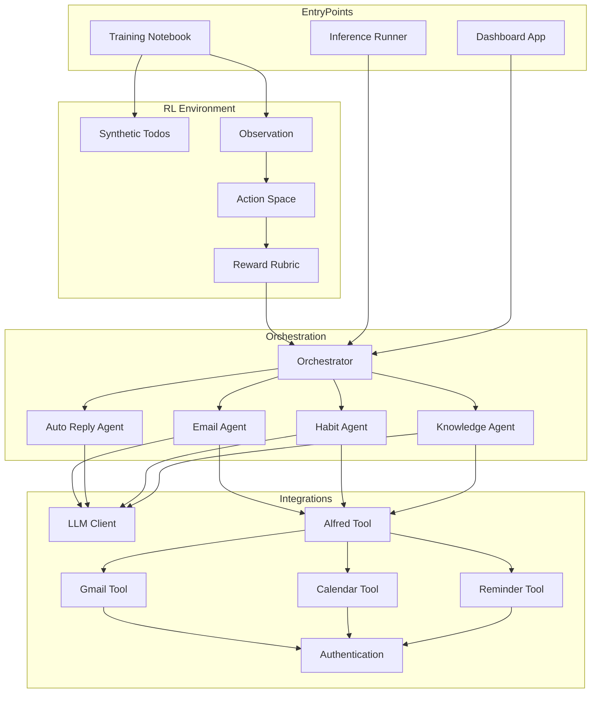
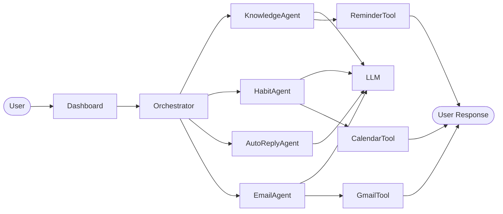
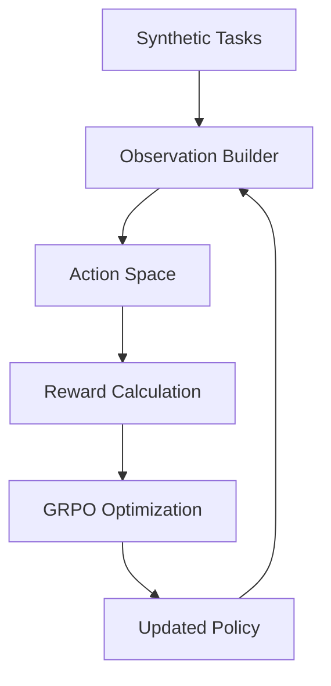
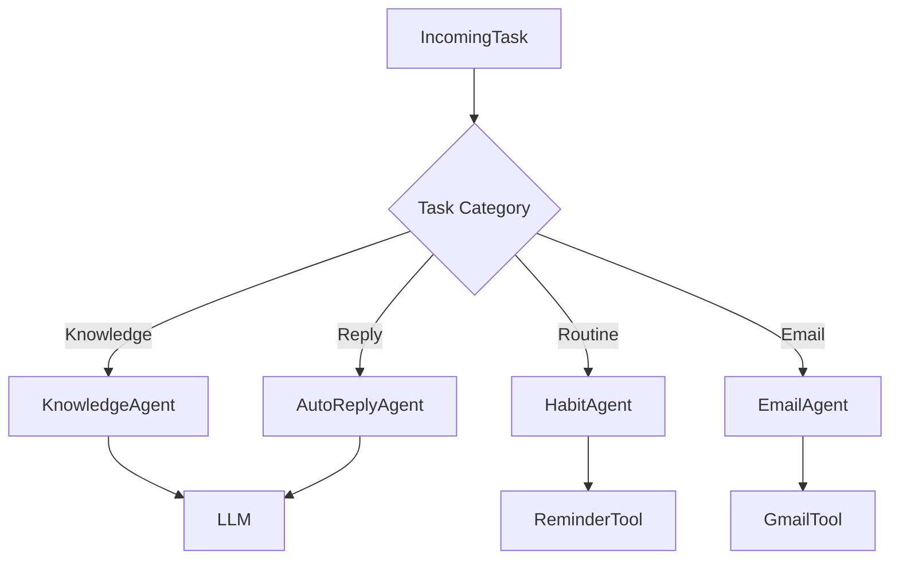
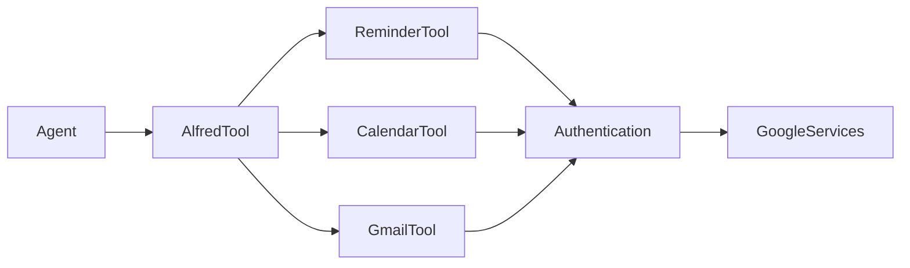
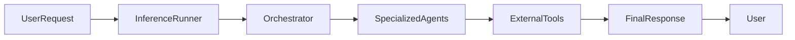

# Alfred - AI Task Orchestration using Multi-Agent Reinforcement Learning

> An intelligent multi-agent task orchestration platform built on the **Model Context Protocol (MCP)** that uses **Group Relative Policy Optimization (GRPO)** to train LLMs to prioritize user well-being while intelligently managing emails, reminders, schedules, habits, and knowledge.

---

# Project Overview

Alfred is an AI-powered orchestration platform that combines multiple specialized agents under a centralized routing engine.

Instead of relying on a single LLM for every request, Alfred classifies incoming tasks and routes them to the most appropriate agent capable of completing the task using external tools such as Gmail, Google Calendar, and Reminder services.

The project also contains a custom Reinforcement Learning environment where synthetic task episodes are generated and optimized using **GRPO** to learn better routing and prioritization policies.

---

# Features

- Multi-Agent AI Architecture
- Intelligent Task Routing
- Reinforcement Learning using GRPO
- Gmail Integration
- Google Calendar Integration
- Reminder Scheduling
- Knowledge Management
- Auto Reply Generation
- Memory Updates
- MCP-based Tool Calling
- Gradio Dashboard
- Synthetic RL Training Environment

---

# Project Structure

```text
alfred/
│
├── app.py
├── inference.py
├── orchestrator.py
│
├── agents/
│   ├── knowledge_agent.py
│   ├── habit_agent.py
│   ├── email_agent.py
│   └── auto_reply_agent.py
│
├── rl/
│   ├── synthetic_todos.py
│   ├── observation.py
│   ├── action_space.py
│   └── rubric.py
│
├── integrations/
│   ├── llm_client.py
│   ├── alfred_tool.py
│   ├── reminder_tool.py
│   ├── calendar_tool.py
│   ├── gmail_tool.py
│   └── alfred_auth.py
│
├── training/
│   └── notebook.ipynb
│
└── requirements.txt
```

---

# System Architecture



---

# Core Components

## Orchestrator

The orchestrator acts as the central routing engine.

Responsibilities

- Receives user requests
- Identifies task category
- Routes tasks to specialized agents
- Maintains execution flow
- Coordinates memory updates

---

## Knowledge Agent

Responsible for

- User preferences
- Knowledge retrieval
- Memory updates
- Personal context management

---

## Habit Agent

Responsible for

- Reminder creation
- Routine planning
- Wellness scheduling
- Habit tracking

---

## Email Agent

Responsible for

- Gmail access
- Email drafting
- Reading emails
- Sending emails

---

## Auto Reply Agent

Responsible for

- Automatic responses
- LLM-based reply generation
- Response composition

---

## Alfred Tool Layer

Acts as the abstraction layer between AI agents and external services.

Provides

- Reminder APIs
- Calendar APIs
- Gmail APIs
- Authentication

---

## RL Environment

Contains

- Synthetic Task Generator
- Observation Builder
- Action Space
- Reward Function

Used for GRPO training.

---

# Application Workflow



---

# GRPO Training Pipeline



---

# Agent Routing Flow



---

# Tool Integration



---

# Inference Workflow



---

# Reinforcement Learning

The RL environment follows the standard interaction loop.

1. Generate synthetic tasks.
2. Build observations.
3. Select actions.
4. Execute routing policy.
5. Compute rewards.
6. Optimize policy using GRPO.
7. Repeat until convergence.

---

# Design Patterns

- Strategy Pattern
- Facade Pattern
- Singleton Pattern
- Factory Pattern
- Dependency Injection
- Composition over Inheritance

---

# Technology Stack

| Component | Technology |
|------------|------------|
| Language | Python 3.11 |
| Training | TRL + Unsloth |
| RL Algorithm | GRPO |
| Interface | Gradio |
| LLM | Gemini / OpenAI Compatible |
| Authentication | OAuth2 |
| Email | Gmail API |
| Scheduling | Google Calendar API |
| Reminder | Reminder API |
| Protocol | Model Context Protocol (MCP) |

---

# Installation

```bash
git clone https://github.com/<username>/alfred.git

cd alfred

pip install -r requirements.txt
```

---

# Running Dashboard

```bash
python app.py
```

---

# Training

```bash
jupyter notebook training.ipynb
```

---

# Inference

```bash
python inference.py
```

---

# Future Enhancements

- Long-term Memory
- Vector Database
- RAG Integration
- Voice Assistant
- Mobile Companion
- Slack Integration
- WhatsApp Integration
- Autonomous Planning
- Multi-LLM Routing
- Distributed Agent Execution

---

# Learning Outcomes

- Multi-Agent Systems
- MCP Architecture
- Reinforcement Learning
- GRPO Optimization
- LLM Tool Calling
- AI Orchestration
- Google API Integration
- Prompt Engineering
- Memory Management
- Production AI Systems

---

# Author

**Sourabh Vamdevan**


